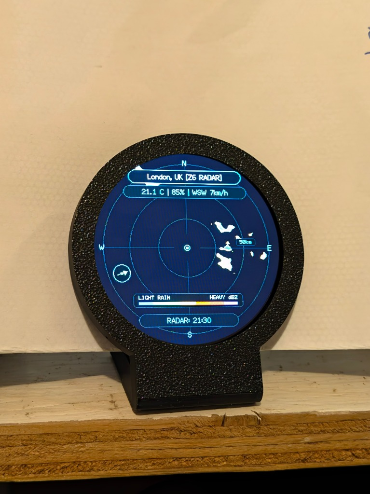
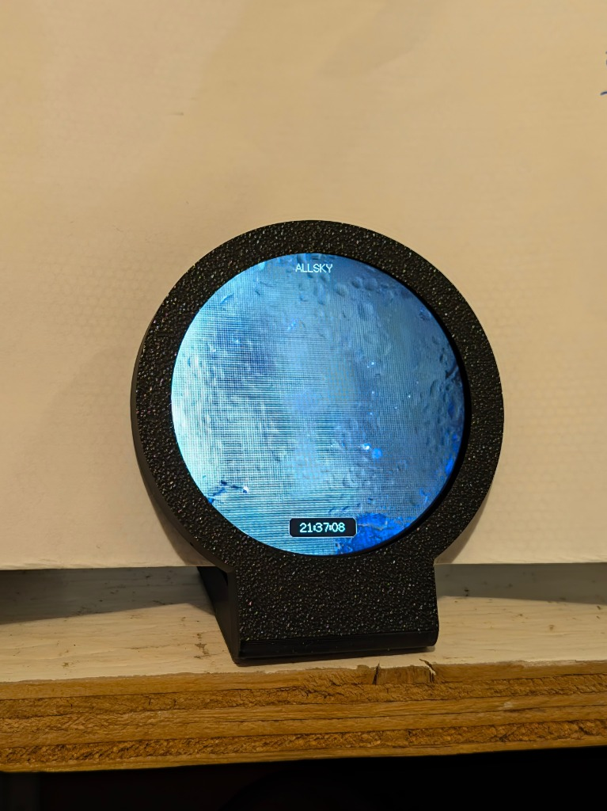

# AllskyRadarView 🌌🌧️

[](https://github.com/oldjiberjaber/AllskyRadarView/actions/workflows/release.yml)
[](https://github.com/oldjiberjaber/AllskyRadarView/releases)
[](LICENSE)

**AllskyRadarView** is a unified, high-performance ESP32-C3 firmware capable of driving **Dual GC9B72 360×360 round LCD displays** (or a single display in radar, allsky, or timed carousel mode).

It bridges your local **Allsky Camera** (via MQTT) and real-time **Weather Radar & Satellite Motion Loops** (via RainViewer & Open-Meteo) into a tactical round observatory HUD.

---

## 📷 Display Preview

| Tactical Weather Radar Scope | Allsky Night Sky Camera View |
|:---:|:---:|
|  |  |
| *Live RainViewer radar, Open-Meteo telemetry & wind vector HUD* | *MQTT Allsky camera feed with capture timestamp* |

---

## 🌟 Key Features

- 🖥️ **Flexible Multi-Display Modes**:
  - **Dual Display**: Screen 1 (CS1) shows live Allsky Camera stream; Screen 2 (CS2) runs the live RainViewer weather radar motion loop & telemetry.
  - **Single Radar**: Single display dedicated to full radar motion loop and weather scope.
  - **Single Allsky**: Single display dedicated to the MQTT Allsky Camera feed.
  - **Timed Carousel**: Single display smoothly alternating between Allsky and Radar every *N* seconds (configurable from 5s to 300s).
- 🌧️ **Live Radar & Satellite Cloud Coverage**:
  - Multi-frame history animation (3, 5, or 8 frames covering 20–80 minutes of storm motion).
  - Stream-decoded via LittleFS and LovyanGFX PNGLE with **zero heap fragmentation** and full DMA acceleration.
  - Switch on-the-fly between **RainViewer Precipitation Radar** and **OpenWeatherMap Satellite Cloud Coverage** with density-mapped silvery cloud gradient rendering.
  - Persistent LittleFS grid caching for zero-latency, zero-API-cost screen switches in Carousel mode.
- 🧭 **Tactical Weather Telemetry**:
  - Real-time temperature, humidity, and 16-point cardinal wind speed & direction (`SW`, `ENE`, `NNE`) from Open-Meteo.
  - Compass needle vector on the radar scope.
- ⚡ **Zero-Lag Shared SPI Bus**:
  - Both GC9B72 360×360 panels operate on the ESP32-C3 FSPI bus clocked at **80 MHz** with hardware DMA.
- 🌐 **Comprehensive Web Configuration Portal & Captive AP**:
  - Interactive **Leaflet.js map picker** for instant GPS geolocation and scope radius visualization.
  - Wi-Fi network scanner.
  - MQTT broker configuration for indi-allsky / Allsky camera servers.
  - Live color palette selection (Universal Blue, NEXRAD, Rainbow, TITAN, Dark Sky, etc.).
- 📶 **Over-The-Air (OTA) Updates**:
  - Fast OTA reflashing with a live tactical circular progress HUD.

---

## 📐 Hardware Wiring Pinout

AllskyRadarView uses an **ESP32-C3 SuperMini** driving one or two **GC9B72 360×360 round SPI LCDs**.

| ESP32-C3 Pin | Screen 1 (Allsky / Main) | Screen 2 (Radar Scope) | Description |
|---|---|---|---|
| **GPIO 4** | `SCL` / `SCLK` | `SCL` / `SCLK` | Shared 80 MHz SPI Clock |
| **GPIO 3** | `SDA` / `MOSI` | `SDA` / `MOSI` | Shared SPI MOSI Data |
| **GPIO 10** | `DC` | `DC` | Shared Data / Command |
| **GPIO 0** | `RST` | `RST` | Shared Hardware Reset |
| **GPIO 5** | `BLK` / `BL` | `BLK` / `BL` | Shared Backlight PWM (44.1 kHz LEDC) |
| **GPIO 1** | **`CS` (Chip Select 1)** | — | Primary Screen Chip Select |
| **GPIO 2** | — | **`CS` (Chip Select 2)** | Secondary Screen Chip Select |
| **GPIO 9** | Button | — | Boot Button (Short press: Refresh / Long press: AP mode) |
| **3V3 / 5V** | `VCC` | `VCC` | Power Supply |
| **GND** | `GND` | `GND` | Common Ground |

---

## 🚀 Getting Started

### 1. Build & Flash via PlatformIO

```bash
# Clone the repository
git clone https://github.com/oldjiberjaber/AllskyRadarView.git
cd AllskyRadarView

# Flash via USB COM Port
pio run -e esp32-c3-usb -t upload

# Or Flash wirelessly via Over-The-Air (OTA)
pio run -e esp32-c3-ota -t upload
```

### 2. First Boot & Setup
1. If no Wi-Fi credentials are stored, the device starts an Access Point: `AllskyRadar-Setup`.
2. Connect to the Wi-Fi network and open `http://192.168.4.1` (or click the captive portal prompt).
3. Select your **Operating Mode** (Dual Screen, Single Radar, Single Allsky, or Carousel).
4. Configure your **Wi-Fi**, **Allsky MQTT topic**, and **Radar Geolocation** using the interactive map.
5. Hit **Save & Apply**!

---

## 📡 Allsky Camera MQTT Configuration

AllskyRadarView connects directly to your MQTT broker to subscribe to and display live exposures as raw binary JPEG payloads:

| Configuration Field | Description | Default / Example |
|---|---|---|
| **MQTT Broker Host / IP** | Hostname or IP address of your MQTT broker | `192.168.0.6` |
| **Port** | MQTT TCP port | `1883` |
| **MQTT Image Topic** | Subscribed topic broadcasting the 360×360 binary JPEG | `allsky/image/thumbnail` or `indi-allsky/thumbnail` |
| **MQTT Username** | Optional authentication username | *(optional)* |
| **MQTT Password** | Optional authentication password | *(optional)* |

---

## 🔭 Allsky 360×360 Thumbnail MQTT Pipeline

This setup automatically generates a square 360×360 thumbnail on every completed exposure and publishes the binary payload to an MQTT broker for consumption by AllskyRadarView, Home Assistant, and downstream dashboards.

### Overview

1. **Trigger:** `indi-allsky` runs an **Image Post-Save Hook** immediately after a new image exposure is processed and saved.
2. **Transform:** A local bash script uses ImageMagick (`convert`) to center-crop and scale the newly captured image down to 360×360 pixels.
3. **Publish:** The script uses `mosquitto_pub` to broadcast the raw binary JPEG directly to a dedicated MQTT topic.

### Prerequisites

```bash
sudo apt-get update
sudo apt-get install -y imagemagick mosquitto-clients
```

### 1. Processing Script

Create `/usr/local/bin/resize_allsky_360.sh`:

```bash
#!/bin/bash
set -e

# Input file path passed by indi-allsky ($1) or fallback to latest image
INPUT_FILE="${1:-/var/www/html/allsky/images/latest.jpg}"
OUTPUT_DIR="/var/www/html/allsky"
OUTPUT_FILE="${OUTPUT_DIR}/image-360.jpg"

# MQTT Broker Configuration
BROKER_IP="<BROKER_IP>"
BROKER_PORT="1883"
MQTT_TOPIC="allsky/image/thumbnail"
# Optional auth:
# MQTT_USER="<USER>"
# MQTT_PASS="<PASSWORD>"

# Ensure input file exists before running
if [ ! -f "$INPUT_FILE" ]; then
    exit 0
fi

# Scale and center-crop to 360x360 JPEG
convert "$INPUT_FILE" \
    -resize 360x360^ \
    -gravity center \
    -extent 360x360 \
    -quality 85 \
    "$OUTPUT_FILE"

# Publish binary JPEG to MQTT broker
# Add -u "$MQTT_USER" -P "$MQTT_PASS" if authentication is enabled
mosquitto_pub \
    -h "$BROKER_IP" \
    -p "$BROKER_PORT" \
    -t "$MQTT_TOPIC" \
    -f "$OUTPUT_FILE"
```

Make the script executable:

```bash
sudo chmod 755 /usr/local/bin/resize_allsky_360.sh
```

### 2. indi-allsky Hook Configuration

1. In the **indi-allsky Web UI**, navigate to the active camera profile settings.
2. Locate the **Image Post-Save Hook** field.
3. Set the value to:
   ```text
   /usr/local/bin/resize_allsky_360.sh
   ```
4. Save and apply changes.

### 3. MQTT Payload & Consumption

* **Topic:** `allsky/image/thumbnail`
* **Payload Type:** Raw binary JPEG
* **Dimensions:** 360 × 360 px
* **Update Frequency:** Real-time on every exposure completion

**Verification via CLI:**

```bash
mosquitto_sub -h <BROKER_IP> -t "allsky/image/thumbnail" -C 1 > /tmp/test_thumb.jpg
file /tmp/test_thumb.jpg
# Expected output: JPEG image data, ... 360x360
```

**Home Assistant Consumer Definition (`configuration.yaml`):**

```yaml
mqtt:
  image:
    - name: "Allsky 360 Thumbnail"
      image_topic: "allsky/image/thumbnail"
      content_type: "image/jpeg"
```

---

## 🛠️ Architecture & Memory Strategy

The ESP32-C3 features ~320 KB SRAM. Decoding full PNG and JPEG images simultaneously requires strict memory architecture:
- **LittleFS Stream Decoding**: Incoming PNG radar tiles and JPEG Allsky images are written sequentially to LittleFS and decoded via file stream callbacks (`drawPng(&file)` and `drawJpg(&file)`), preventing RAM fragmentation and leaving $>180\text{ KB}$ contiguous free memory.
- **DCT Scaling**: Incoming Allsky JPEG images are prescaled in hardware DCT down to the target 360×360 panel size.

---

## 📄 License

Distributed under the MIT License. See `LICENSE` for details.

